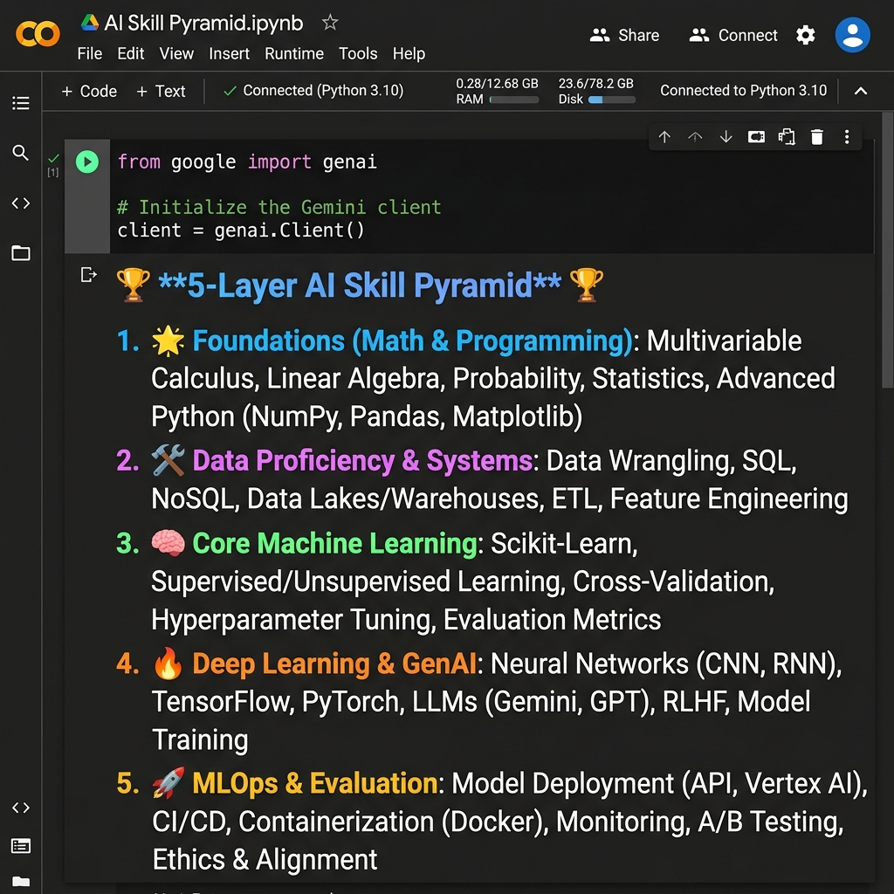

# AI Mentor Bootcamp — Murugu Sirisha MadhuVarshini

Welcome to my public portfolio for the 12-day AI Trainer Bootcamp/Workshop. This repository tracks daily notebooks, configuration files, and deliverables.

---

## Day 1 — Setup Complete

### Deliverables
- **API Setup:**
  - ✅ Google AI Studio API key provisioned and verified.
  - ✅ Groq API key provisioned and verified.
- **Hello-Gemini Call:**
  - ✅ Hello-Gemini API call working. See the notebook [Day1_Setup.ipynb](Day1_Setup.ipynb).
- **Comparison Matrix:**
  - ✅ 4-tool comparison matrix completed.

### Lab 1A: 4-Tool Comparison Matrix

Below is the comparison matrix evaluating ChatGPT, Claude, Gemini, and Perplexity across summarization, coding, and reasoning tasks:

| Tool | Task 1 (Summarise) | Task 2 (Code) | Task 3 (Reason) | My Verdict |
| :--- | :---: | :---: | :---: | :--- |
| **ChatGPT** | 4 | 4 | 4 | *All-rounder. Best default choice for general tasks.* |
| **Claude** | 5 | 4 | 5 | *Best for thorough writing and careful reasoning. Slower.* |
| **Gemini** | 4 | 3 | 3 | *Good for quick factual queries. Weaker at code constraints.* |
| **Perplexity** | 4 | 3 | 2 | *Best when I need cited sources. Weakest for pure reasoning.* |

### 3-Sentence Conclusion
> "I would use **ChatGPT** for general tasks where I need a fast, well-structured response."
> 
> "I would use **Claude** for long documents, careful reasoning, and high-stakes writing."
> 
> "I would use **Perplexity** for any factual claim I cannot afford to get wrong."

### Hello-Gemini Call Output


---

## Day 2 — Structured Outputs & Prompting

### Deliverables
- **Lab 2A: Six-Pattern Drills**
  - Documented six structurally distinct prompting patterns for explaining Big-O notation. See [Day2_SixPatterns.md](Day2_SixPatterns.md).
- **Lab 2B: JSON Résumé Extractor**
  - Completed the Pydantic-validated resume parser. See [Day2_ResumeExtractor.ipynb](Day2_ResumeExtractor.ipynb).

### Day 2 Lab 2B — Errors Handled

1. **Markdown Fence Wrapping (` ```json ... ``` `)**
   - **Handling:** Implemented a retry loop. If Pydantic fails to parse because of markdown wrapping, a correction prompt asks Gemini to fix the JSON output.
2. **Missing Phone Numbers**
   - **Handling:** Defined the Pydantic schema field with `Optional[str] = None` to gracefully default to `null` instead of raising a validation error.
3. **Empty / Whitespace-only Inputs**
   - **Handling:** Pydantic raises a structured `ValidationError` with `"Field required"` which is caught by the caller to handle empty or invalid inputs gracefully.

### Sample Résumés Processed
- Ravi Kumar — 6 skills, 1.0 years exp (Success)
- Sneha Reddy — 6 skills, 0.5 years exp (Success)
- Arun Pillai — 9 skills, 1.0 years exp (Success)
